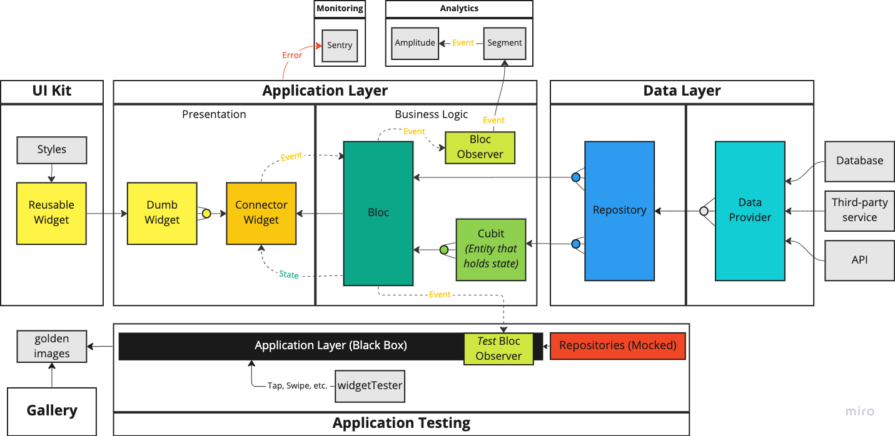

# Overview

This documentation will give a high-level overview of the Coral Flutter architecture.

**Note**: _Many of the following terms / layers are taken from the [bloc architecture](https://bloclibrary.dev/#/architecture). This is an intentional choice to be consistent with the Flutter Community's usage. If you come from a Domain Driven Design background, these terms / layers may not line up to your existing definitions._



We will discuss the following concepts from this diagram:

- Data Layer
- Application Layer
- UI Kit
- Application Testing
- Gallery
- Analytics
- Monitoring

## Data Layer

The Data Layer is an abstraction layer to encapsulate data coming from concrete sources, such as databases, network requests, third-party services, etc. Within the data layer, we have Data Providers and Repositories.

Ideally, the Data Layer is not meant to be tied to a single mobile app. However, it can start there and then get pulled out when there is a second use-case.

### Data Provider

Data Providers will wrap concrete databases, network requests etc, and is the lowest-level in our abstraction hierarchy.

### Repository

Repositories will wrap _1 or more_ Data Providers and will be used to communicate to Blocs and Cubits.

_Note: We have made a design choice where application state is **not** held in repositories. All application state will be held in Blocs or Cubits._

## Application Layer

The Application Layer includes the Presentation and the Business Logic of your application.  This layer is intended to be specific to a single mobile application.

### Business Logic

The Business Logic layer is comprised of Blocs and Cubits. We have made a design choice that Blocs and Cubits will be used for specific and distinct purposes.

#### Blocs

The term `Bloc` stands for **B**usiness **Lo**gic **C**omponent. A Bloc is a component that takes in a stream of events, does work*, then outputs a stream of states.

_*The work that the Bloc does is typically outsourced to either a Repository or a Cubit (which then outsources the work to a Repository).)_

For the most part, we generally create a Bloc for either a page or a flow in the Presentation Layer. Our goal is to fire an event for (nearly) every single user interaction with the application.  The Bloc will do some work, and then emit a new state back to the Presentation Layer. The Presentation Layer will then **react** to the new state.

#### Cubits

Cubits are like the junior version of Blocs with two distinct differences:

1. Cubits do not listen for events and their methods are called directly
2. Cubit methods can be asynchronous.

As a design choice, we want all user interactions to fire events, which means cubit methods can not be called from the Presentation Layer directly. However, the Presentation Layer can depend on and react to a Cubit's state.

The prevailing use case for Cubits is to store an Entity's state that multiple Blocs depend on. For example, if we had a User Entity and a UserCubit, then we can pass the UserCubit to BlocA and BlocB. By passing the UserCubit to both blocs, and the UserCubit being the single source of truth for the User's state, both BlocA and BlocB will never have a stale reference to the User's State.

#### Bloc Observer

The Bloc observer will listen for events coming in to Blocs and state changes coming from both Blocs and Cubits.

In development we will:

- log these events to the console
- forward these events to our redux_remote_devtools*

_Note: while we are not using redux, redux_remote_devtools is a nice tool for development and we shoe-horned a way for it to work with Bloc._

In staging and production we will:

- forward these events to an analytics service to track user behavior and trends, such as [Segment](https://segment.com/) and [Amplitude](https://amplitude.com/)

### Presentation

The next piece of the Application Layer is the Presentation Layer.  This layer is everything that drives the UI of our mobile application and what the user ultimately sees.

As a design choice, we are going to split out our widgets in to two distinct types: dumb widgets and connector widgets.

#### Dumb widgets

Dumb widgets are intended to only depend on its inputs and contain zero business logic. Dumb widgets can however, contain styling.

For example, this is NOT a good dumb widget because it contains logic to fire an event to a specific bloc.

```dart
class BadButton_Dumb extends StatelessWidget {
  const BadButton_Dumb({super.key});

  @override
  Widget build(BuildContext context) {
    final fooBloc = context.watch<FooBloc>();

    return ElevatedButton(
      onPressed: () => fooBloc.add(FooEvent_Increment),
      child: const Text('Increment',
        style: const TextStyle(color: Colors.pink),
      ),
    );
  }
}
```

This on the other hand, is a good dumb widget.

```dart
class GoodButton_Dumb extends StatelessWidget {
  const GoodButton_Dumb({
    super.key,
    required this.onPressed,
    required this.label,
  });

  final VoidCallback onPressed;
  final String label;

  @override
  Widget build(BuildContext context) {
    return ElevatedButton(
      onPressed: onPressed,
      child: Text(
        label,
        style: const TextStyle(color: Colors.pink),
      ),
    );
  }
}
```

You may be thinking that we lost information between the bad example and the good example, and that is true - we lost the concrete `onPressed` callback and the label for the button. That is where connector widgets come in.

_Note: Over time, many of these dumb widgets can get extracted in to a **UI Kit** that can be shared across mobile applications._

#### Connector Widgets

We use connector widgets to gather all of the needed inputs to pass in to dumb widgets. This helps keep the dumb widgets free from hard-coded dependencies and makes them great candidates to be promoted in to our UI Kit.

Here is an example of passing in an onPressed callback and a label in to our dumb widget.

```dart
class GoodButton_Connector extends StatelessWidget {
  const GoodButton_Connector({super.key});

  @override
  Widget build(BuildContext context) {
    final fooBloc = context.watch<FooBloc>();

    return GoodButton_Dumb(
      onPressed: () => fooBloc.add(FooEvent_Increment),
      label: 'Increment',
    );
  }
}
```

_Note: Over time, we want to have less and less dumb widgets defined in our application. If that happens, it means are are creating truly reusable widgets in our UI Kit._

## UI Kit

The UI Kit is a warehouse of reusable widgets and styling. The UI Kit is intended to be able to service 1 or more applications.

### Reusable Widgets

For widgets to be promoted to the UI Kit, this is a likely pathway:

1. Widget starts off as a dumb widget for a given page in a given application.
2. Widget gets promoted to the shared dumb widgets for a given application.
3. Widget gets promoted to the UI Kit.

This pathway is preferred because it gives the dumb widget an opportunity to experience multiple use-cases within a single app before reaching the UI Kit and potentially having a poor API. If you squint, you can think of the shared dumb widgets in an application as you would a staging environment and the UI Kit as the production environment.

### Styling

Company styling should be defined in the UI Kit, from font-sizes to colors to spacings, etc.  The reusable widgets defined in the UI Kit should use these styles.  In addition, the dumb widgets specific to an application should also use these styles as much as possible. It will make promotion of the dumb widgets easier and keep everything consistent across applications.

## Application Testing

Flutter_bloc recommends testing the business logic directly and provides a convenience [bloc_test](https://pub.dev/packages/bloc_test) tool.  However, we deviate from this recommendation and **never** test the business logic directly.

In our experience, too many bugs live in the space between the business logic and the presentation layer. So we treat the entire application layer as a black box, and limit ourselves to interact with the application the same way a user would. By doing this kind of testing, we will ensure that a user can actually 'wiggle' every line of our business logic. If they can't, then that business logic is either not wired up properly to the presentation layer or it shouldn't exist.

In short, we are favoring integration tests with mocks. We are comfortable with this approach because the tests are headless and run pretty fast.

## Gallery

We have repurposed _golden images_* to describe our user stories and present them in a gallery for easy consumption by engineering, design, product, etc. In our experience, this has been invaluable to cross-functional collaboration.

_*Flutter can take screenshots of our UI when we execute our headless tests.  After manual review, we can 'bless' any of these screenshots to be golden images, and then any time our tests would produce an image that doesn't match the golden images, the tests fail._

## Analytics

Since we have an event-driven state management architecture, we benefit from being able to observe those events. We have chosen to forward those events to [Segment](https://segment.com/), and [Amplitude](https://amplitude.com/), but we could forward them anywhere.

## Monitoring

The application layer can run in to exceptions from time to time, and we have chosen to use [Sentry](https://sentry.io/welcome/) for monitoring, but we could forward these exceptions anywhere.
