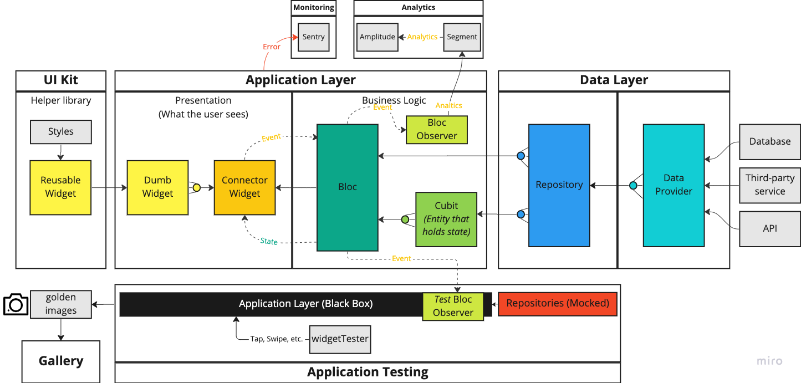

# Overview

This documentation will give a high-level overview of the Coral Flutter architecture.

**Note**: _Many of the following terms / layers are taken from the [bloc architecture](https://bloclibrary.dev/#/architecture). This is an intentional choice to be consistent with the Flutter Community's usage. If you come from a Domain Driven Design background, these terms / layers may not line up to your existing definitions._

We will discuss the following concepts from this diagram:

- Data Layer
- Application Layer
- UI Kit`
- Application Testing
- Gallery
- Analytics
- Monitoring
