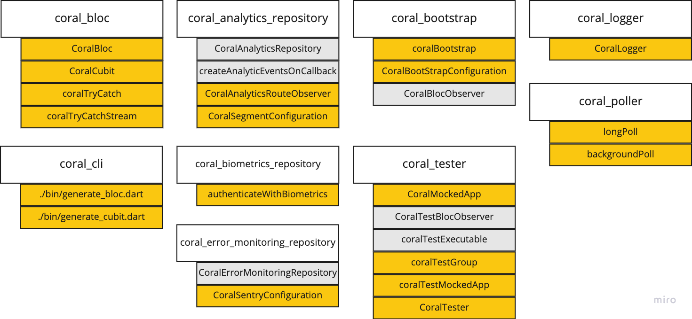

# Coral Packages



_Note: In the image above, the orange boxes are things you will likely use at some point. The grey boxes are things that the packages provide, but that you will likely not need to use directly._

coral_flutter includes the following packages:

- `coral_analytics_repository`
- `coral_bloc`
- `coral_bootstrap`
- `coral_cli`
- `coral_error_monitoring_repository`
- `coral_poller`
- `coral_tester`

## Coral Analytics Repository

This is a crucial repository to coral_flutter. This repository is responsible for observing bloc, cubit, and navigator events and forwarding them to an analytics service such as Segment.

This exposes three main things:

1. CoralAnalyticsRepository (wired up for you)
2. createAnalyticsOnEventCallback (wired up for you)
3. CoralAnalyticsRouteObserver (manual)
4. CoralSegmentConfiguration (manual)

1) `CoralAnalyticsRepository` is used by `coralBootstrap` (from the `coral_bootstrap` package), and will be wired up automatically.

2) `createAnalyticsOnEventCallback` is also used by `coralBootstrap` and will automatically create a `CoralBlocObserver` with this callback added. This is what will process our analytic listeners that we define with our blocs.

3) The `CoralAnalyticsRouteObserver` is **not** wired up automatically, and you will need to add it to your app's router. This will create analytic events for all of your route changes.

```dart
GoRouter appRouter({
  required CoralAnalyticsRepository? analyticsRepository,
}) =>
    GoRouter(
      observers: [
        CoralAnalyticRouteObserver(analyticsRepository: analyticsRepository),
      ],
      routes: <GoRoute>[
        GoRoute(
          name: AppRoutes.home.name,
          path: '/',
          builder: (BuildContext context, GoRouterState state) =>
              const Home_Page(),
        ),
      ],
    );
```

4) The `CoralSegmentConfiguration` is used by the `CoralBootstrapConfiguration` and will be how you pass in your Segment api key.

## Coral Bloc

This package exposes the following:

1. CoralBloc
2. CoralCubit
3. coralTryCatch and coralTryCatchStream

1) All of our blocs will extend `CoralBloc` instead of `Bloc`. CoralBloc subclasses Bloc and adds several fields to make using redux_remote_devtools easier. In addition, CoralBloc also preserves the `mapEventToState` api that used to be a part of Bloc. We preserved it because it plays nicely with our eventType enum that we use for our bloc events. This will allow us to switch over the eventType enum and have our editor help us if we forget to handle an event.

2) All of our cubits will extend `CoralCubit` instead of `Cubit`. CoralCubit also adds a few things to make using redux_remote_devtools easier.

3) Anytime we use a method from a repository in our blocs, we should wrap them with `coralTryCatch` or `coralTryCatchStream`. This will ensure a consistent handling of potential errors.

## Coral Bootstrap

This package exposes the following:

- coralBootstrap (manual)
- CoralBootstrapConfiguration (manual)
- CoralBlocObserver (wired up for you)

1) `coralBootstrap` is how we bootstrap all of our applications. It will set up our logger, our analytics, our error handling, and our bloc observer.

2) `CoralBootstrapConfiguration` is how bootstrap will pull in your client-side secrets and configuration.

3) `CoralBlocObserver` is how we observe our bloc events and state changes. Under the hood, this will use the `createAnalyticsOnEventCallback` from the `AnalyticsRepository`.

## Coral Cli

The **coral cli** can be found in `packages/coral_cli`. Currently it does two things:

1. Generates blocs
2. Generates cubits

Since there is a lot of boilerplate to wire up a new bloc or cubit, we built these commands to do it for you.

### Generating a bloc

```sh
cd packages/coral_cli

./bin/generate_bloc.dart ../../examples/counter_example
# When prompted, input the name of the bloc in PascalCase
# Examples: Counter, FooBar
```

### Generating a cubit

```sh
cd packages/coral_cli

./bin/generate_cubit.dart ../../examples/counter_example
# When prompted, input the name of the cubit in PascalCase
# Examples: User, FooBar
```

## Coral Error Monitoring Repository

This package includes:

1. CoralErrorMonitoringRepository (wired up for you)
2. CoralSentryConfiguration (manual)

1) The `CoralErrorMonitoringRepository` is not something you will ever need to touch. It is wired up for you by `coralBootstrap`.

2) The `CoralSentryConfiguration` is how we pass in the Sentry `dsn` so `coralBootstrap` knows how to configure the CoralErrorMonitoringRepository.

## Coral Logger

This packages exposed a `CoralLogger` which is a thin wrapper for [lumberdash](https://pub.dev/packages/lumberdash).

Anytime we want to log anything in our application, we should instantiate a `CoralLogger()` object and use one of its log methods. We do this so we can have control over where the logs go (nowhere, the console, to sentry, etc).

## Coral Poller

1. longPoll
2. backgroundPoll

1) `longPoll` is function that will continuously run a callback at a specified interval until it either completes, times out, or throws an error.

2) `backgroundPoll` is a function that will call the `callback` function within the [pollRule], while continuously calling `backgroundCallback` until the [Completer] passed into the `callback` completes successfully or with an error. Exceptions caught while calling either `callback` or `backgroundCallback` will immediately stop the polling and the function will return a [BackgroundPollResult] with an error status and the caught exception.

## Coral Tester

This packages exposes the following:

1. CoralMockedApp
2. CoralTestBlocObserver (wired up for you)
3. coralTestExecutable (almost wired up for you)
4. coralTestGroup and coralTestMockedApp
5. CoralTester (wired up for you)

1) All of our tests will actually start from our `App` widget. `CoralMockedApp` is simply a way to mock out the repository layer used by your blocs. See the counter_example for use of `CoralMockedApp` and the data_layer_example for how to extend the CoralMockedApp and add additional repositories.

2. The `CoralTestBlocObserver` is wired up for you and will keep track of bloc events as well as the analytic events that would have been sent off to Segment.

3. The `coralTestExecutable` is a default test configuration that should be used like this:

```dart
// test/flutter_test_config.dart

import 'package:coral_tester/coral_tester.dart';

const testExecutable = coralTestExecutable;
```

4. `coralTestGroup` and `coralTestMockedApp` should be used for all of our application tests. `coralTestGroup` allows you to pass in a userStoryId to organize our tests. `coralTestMockedApp` is similar to `widgetTest` but it gives you a `CoralTester` instead of a `widgetTester`.

5. The `CoralTester` is a superset of the `widgetTester` and gives you several pieces of functionality to make writing tests easier. In particular, it will keep track of your bloc events, analytics, user actions, and expectations, and then create a gallery from them.
