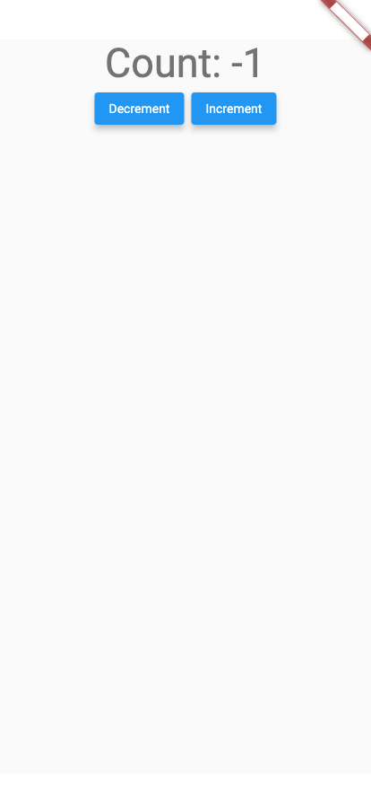

# As a user, I should be able to change the count, so that I can keep count of things.
<table>
  <tbody>
   <tr>
      <td>
<b>Expect:</b>
<ul>
  <li>Should see initial count of zero</li>
  <li>Should not see a count of -1</li>
  <li>Should not see a count of 1</li>
</ul>
      </td>
      <td>
      
      </td>
   </tr>
  </tbody>
</table>

### As a user, I want to be able to decrement the count
<table>
  <tbody>
   <tr>
      <td>
<b>Expect:</b>
<ul>
  <li>Should see count decremented by one</li>
</ul>
<b>Actions:</b>
<ul>
  <li>TAP: text "Decrement"</li>
</ul>
<b>Events:</b>
<ul>
  <li>CounterEvent_Decrement</li>
</ul>
<b>Analytics:</b>
<ul>
  <li>Track: Counter: Decrement</li>
</ul>
      </td>
      <td>
      
      </td>
   </tr>
  </tbody>
</table>

### As a user, I want to be able to increment the count
<table>
  <tbody>
   <tr>
      <td>
<b>Expect:</b>
<ul>
  <li>Should see count incremented by two</li>
</ul>
<b>Actions:</b>
<ul>
  <li>TAP: text "Increment"</li>
  <li>TAP: text "Increment"</li>
</ul>
<b>Events:</b>
<ul>
  <li>CounterEvent_Increment</li>
  <li>CounterEvent_Increment</li>
</ul>
<b>Analytics:</b>
<ul>
  <li>Track: Counter: Increment</li>
  <li>Track: Counter: Increment</li>
</ul>
      </td>
      <td>
      
      </td>
   </tr>
  </tbody>
</table>
