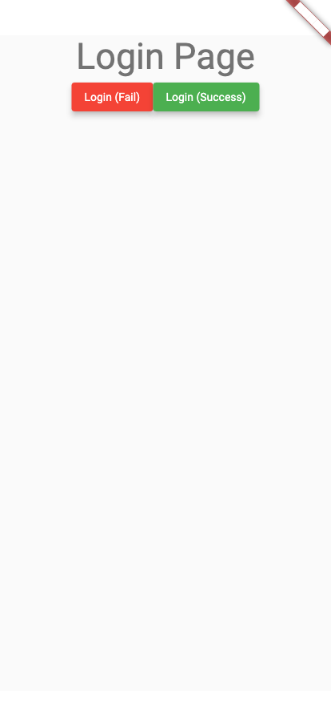

# As a user, if I attempt to login and I cannot authenticate, I would like to be made aware

### If this is my first time opening the app, and I am not authenticated, I should be on the login page
<table>
  <tbody>
   <tr>
      <td>
<b>Expect:</b>
<ul>
  <li>I should be on the login page</li>
  <li>I should not be on the home page.</li>
</ul>
<b>Events:</b>
<ul>
  <li>AuthenticationEvent_Initialize</li>
</ul>
 

 
      </td>
      <td>
      
      </td>
   </tr>
  </tbody>
</table>

### If I attempt to log in, and I cannot authenticate, I should see a snackbar
<table>
  <tbody>
   <tr>
      <td>
<b>Expect:</b>
<ul>
  <li>I should still be on the login page</li>
  <li>I should see a snackbar</li>
</ul>
<b>Actions:</b>
<ul>
  <li>TAP: type "LoginC_LoginFailButton"</li>
</ul>
<b>Events:</b>
<ul>
  <li>AuthenticationEvent_Login</li>
  <li>AuthenticationEvent_LoginFailed</li>
</ul>
 

 
<b>Analytics:</b>
<ul>
  <li>Track: Login Attempted</li>
  <li>Track: Login Failed</li>
</ul>
      </td>
      <td>
      
      </td>
   </tr>
  </tbody>
</table>
